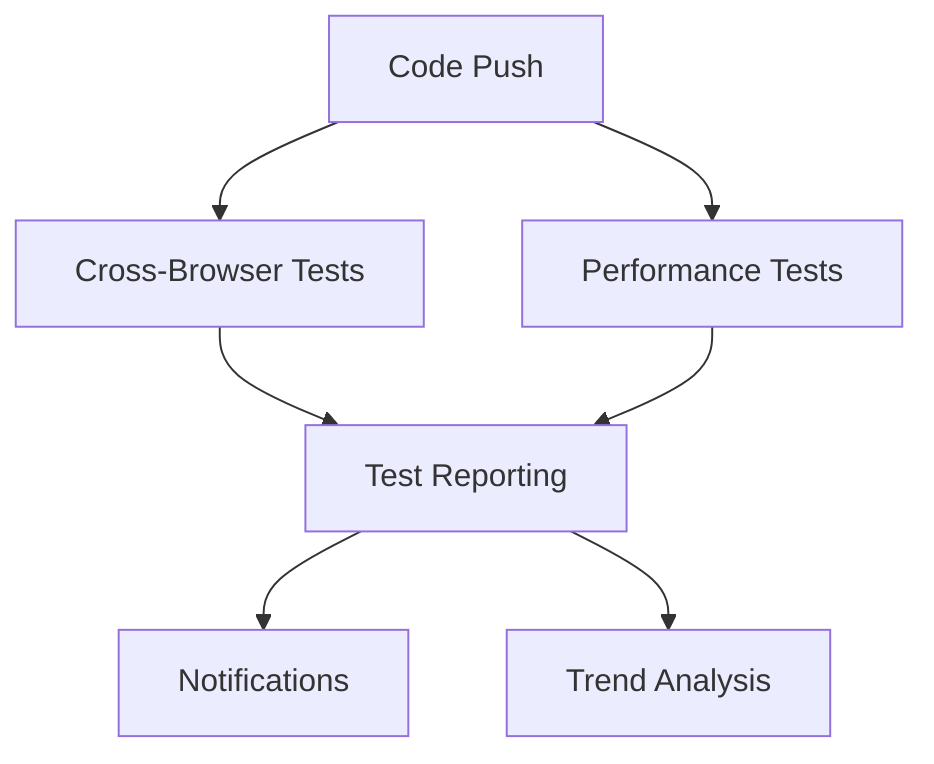

# Comprehensive Testing Guide - Study Teddy

This guide provides complete documentation for the comprehensive cross-browser testing and performance benchmarking setup for Study Teddy.

## 🎯 Overview

Our testing strategy covers:
- **Cross-browser E2E testing** across Chrome, Firefox, Safari, and Edge
- **Mobile browser testing** for responsive design validation
- **Visual regression testing** to catch UI changes
- **Performance monitoring** with Core Web Vitals and Lighthouse
- **Load testing** with k6 for scalability validation
- **Bundle size monitoring** for performance optimization
- **Accessibility testing** for WCAG compliance

## 🏗️ Testing Architecture

### Test Types and Tools

| Test Type | Tool | Purpose | Frequency |
|-----------|------|---------|-----------|
| E2E Tests | Playwright | Cross-browser functionality | Every PR |
| Visual Regression | Playwright | UI consistency | Every PR |
| Performance | Lighthouse CI | Core Web Vitals | Daily |
| Load Testing | k6 | Scalability | Weekly |
| Bundle Analysis | Custom Scripts | Size optimization | Every build |
| Accessibility | axe-core | WCAG compliance | Every PR |

### Browser Matrix

| Browser | Desktop | Mobile | Visual Tests | Performance |
|---------|---------|---------|--------------|-------------|
| Chrome | ✅ | ✅ | ✅ | ✅ |
| Firefox | ✅ | ❌ | ✅ | ✅ |
| Safari | ✅ | ✅ | ✅ | ✅ |
| Edge | ✅ | ❌ | ✅ | ❌ |

## 🚀 Quick Start

### Install Dependencies

```bash
# Install all dependencies including test tools
bun install

# Install Playwright browsers
bunx playwright install --with-deps
```

### Run Tests

```bash
# Run all tests (comprehensive)
bun run test:all

# Run only essential tests (fast)
bun run test:all:fast

# Run specific test types
bun run test:e2e:chrome      # E2E tests in Chrome
bun run test:e2e:mobile      # Mobile browser tests
bun run test:visual          # Visual regression tests
bun run test:lighthouse      # Performance tests
bun run test:performance     # Load tests with k6
bun run test:bundle-size     # Bundle size check
```

### Generate Reports

```bash
# Generate HTML test report
bun run test:all:html

# Analyze bundle composition
bun run analyze:bundle

# Check performance budget
bun run test:performance-budget
```

## 📋 Test Scenarios

### Critical User Flows

#### Authentication Flow
- ✅ User registration with validation
- ✅ User sign-in with error handling
- ✅ Password reset functionality
- ✅ Session management and logout

#### Task Management
- ✅ Create tasks with various priorities
- ✅ Edit and update task details
- ✅ Mark tasks as completed
- ✅ Delete tasks with confirmation
- ✅ Filter and search tasks
- ✅ Sort tasks by different criteria

#### Focus Sessions
- ✅ Start Pomodoro sessions
- ✅ Pause and resume functionality
- ✅ Session completion handling
- ✅ Statistics tracking
- ✅ Goal setting and progress

#### Calendar Integration
- ✅ View monthly/weekly/daily calendar
- ✅ Create and edit events
- ✅ Task deadline integration
- ✅ External calendar sync
- ✅ Recurring events

#### AI Features
- ✅ AI study plan generation
- ✅ Task suggestions
- ✅ Performance analytics
- ✅ Smart scheduling
- ✅ Chat assistant
- ✅ Content summarization

### Performance Benchmarks

#### Core Web Vitals Targets

| Metric | Good | Needs Improvement | Poor |
|--------|------|-------------------|------|
| **First Contentful Paint (FCP)** | ≤ 1.8s | 1.8s - 3.0s | > 3.0s |
| **Largest Contentful Paint (LCP)** | ≤ 2.5s | 2.5s - 4.0s | > 4.0s |
| **First Input Delay (FID)** | ≤ 100ms | 100ms - 300ms | > 300ms |
| **Cumulative Layout Shift (CLS)** | ≤ 0.1 | 0.1 - 0.25 | > 0.25 |

#### Bundle Size Budgets

| Asset Type | Budget | Current | Status |
|------------|--------|---------|--------|
| **Main JS Bundle** | 250 KB | TBD | 🟡 |
| **Vendor Bundle** | 400 KB | TBD | 🟡 |
| **CSS Bundle** | 50 KB | TBD | 🟡 |
| **Total Bundle** | 800 KB | TBD | 🟡 |

## 🔧 Configuration Files

### Playwright Configuration (`playwright.config.ts`)

```typescript
// Configured for:
// - Cross-browser testing (Chrome, Firefox, Safari, Edge)
// - Mobile device emulation
// - Visual regression testing
// - Performance testing
// - Accessibility testing
// - Parallel execution with sharding
```

### Lighthouse CI (`lighthouserc.js`)

```javascript
// Configured for:
// - Desktop and mobile audits
// - Core Web Vitals monitoring
// - Performance budget enforcement
// - Accessibility compliance checking
// - Best practices validation
```

### k6 Load Testing (`tests/performance/load-test.js`)

```javascript
// Test scenarios:
// - Baseline load (10 users, 5 minutes)
// - Spike test (up to 100 users)
// - Stress test (gradual increase to 100 users)
// - Soak test (20 users, 1 hour)
```

## 📊 CI/CD Integration

### GitHub Actions Workflows

#### Cross-Browser Testing (`cross-browser-testing.yml`)
- **Triggers**: Push to main/develop, PRs, daily schedule
- **Matrix Strategy**: Browser × Shard parallelization
- **Artifacts**: Test reports, screenshots, videos
- **Notifications**: Slack alerts on failure

#### Performance Testing (`performance-testing.yml`)
- **Lighthouse Audits**: Desktop and mobile
- **Core Web Vitals**: Automated monitoring
- **Load Testing**: k6 execution on staging
- **Bundle Analysis**: Size tracking and regression detection

#### Test Reporting (`test-reporting.yml`)
- **Aggregation**: Collect results from all workflows
- **Trend Analysis**: Historical performance tracking
- **Report Generation**: HTML and JSON reports
- **Stakeholder Notifications**: Automated summaries

### Workflow Dependencies



## 📈 Performance Monitoring

### Real-Time Metrics

- **Core Web Vitals** tracking in production
- **Bundle size** monitoring on each deploy
- **Performance budget** violations alerting
- **Load test** results trending

### Performance Budget Enforcement

```javascript
// Automatic checks for:
// - Bundle size increases > 10%
// - Core Web Vitals regressions > 20%
// - Page load time increases > 500ms
// - Lighthouse score drops > 5 points
```

## 🧪 Test Development Guidelines

### Writing E2E Tests

```typescript
// Use data-testid attributes for reliable selectors
await page.click('[data-testid="submit-button"]');

// Wait for network requests to complete
await page.waitForLoadState('networkidle');

// Handle dynamic content
await page.waitForSelector('[data-testid="dynamic-content"]');
```

### Visual Regression Tests

```typescript
// Hide dynamic content
await page.addStyleTag({
  content: '[data-testid="timestamp"] { visibility: hidden; }'
});

// Take stable screenshots
await expect(page).toHaveScreenshot('page-name.png', {
  fullPage: true,
  animations: 'disabled'
});
```

### Performance Tests

```typescript
// Measure Core Web Vitals
const vitals = await page.evaluate(() => {
  return new Promise((resolve) => {
    // Web Vitals measurement code
  });
});

expect(vitals.LCP).toBeLessThan(2500);
```

## 🔍 Debugging and Troubleshooting

### Common Issues

#### Flaky Tests
- Use `waitForLoadState('networkidle')` for dynamic content
- Add explicit waits for animations
- Disable animations in test environment

#### Performance Test Failures
- Check network conditions during test execution
- Verify test environment resources
- Review performance budget thresholds

#### Visual Regression Failures
- Update baseline images after intentional UI changes
- Mask dynamic content areas
- Ensure consistent test environment

### Debug Commands

```bash
# Run tests in headed mode
bun run test:e2e:headed

# Debug specific test
bunx playwright test --debug tests/e2e/authentication.spec.ts

# Generate trace files
bunx playwright test --trace on

# Update visual baselines
bunx playwright test --update-snapshots
```

## 📊 Reporting and Analytics

### Test Reports

- **HTML Reports**: Comprehensive test results with screenshots and videos
- **JSON Reports**: Machine-readable results for further analysis
- **Allure Reports**: Advanced reporting with historical trends
- **Slack Notifications**: Real-time alerts for stakeholders

### Metrics Dashboard

Track key testing metrics:
- Test execution time trends
- Pass/fail rates by browser
- Performance regression alerts
- Bundle size evolution
- Coverage reports

## 🎯 Best Practices

### Test Organization
- Group related tests in describe blocks
- Use descriptive test names
- Implement proper setup and teardown
- Share common utilities across tests

### Performance Testing
- Test on production-like environments
- Use realistic user scenarios
- Monitor key user journeys
- Set appropriate performance budgets

### Visual Testing
- Establish baseline images carefully
- Handle dynamic content appropriately
- Test across different viewport sizes
- Review changes systematically

## 🔄 Maintenance

### Regular Tasks
- **Weekly**: Review performance trends
- **Monthly**: Update browser versions and dependencies
- **Quarterly**: Audit and update performance budgets
- **As needed**: Update test scenarios for new features

### Dependency Updates
```bash
# Update Playwright
bunx playwright install

# Update other testing dependencies
bun update @playwright/test @lhci/cli k6

# Regenerate lock file
bun install
```

## 📚 Resources

### Documentation
- [Playwright Documentation](https://playwright.dev/)
- [Lighthouse CI Documentation](https://github.com/GoogleChrome/lighthouse-ci)
- [k6 Documentation](https://k6.io/docs/)
- [Web Vitals Guide](https://web.dev/vitals/)

### Tools and Extensions
- [Playwright Test Generator](https://playwright.dev/docs/codegen)
- [Lighthouse Browser Extension](https://developers.google.com/web/tools/lighthouse)
- [axe DevTools](https://www.deque.com/axe/devtools/)

---

## 📞 Support

For questions about the testing setup:
- Check existing test files for examples
- Review CI/CD workflow logs
- Consult team documentation
- Reach out to the QA team

This comprehensive testing setup ensures Study Teddy maintains high quality across all browsers and devices while providing excellent performance for all users.