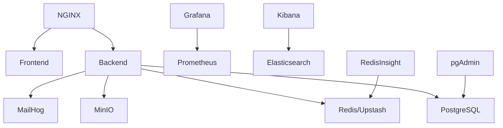

# 🐳 Complete Docker Deployment Guide for Study Teddy

## 📋 Table of Contents
1. [Prerequisites](#prerequisites)
2. [Quick Start](#quick-start)
3. [Production Deployment](#production-deployment)
4. [Service Configuration](#service-configuration)
5. [Environment Variables](#environment-variables)
6. [Monitoring & Management](#monitoring--management)
7. [Troubleshooting](#troubleshooting)
8. [Scaling](#scaling)

---

## 🚀 Prerequisites

### Required Software
- **Docker**: 24.0+ with Docker Compose V2
- **Git**: For cloning the repository
- **Make**: For running deployment scripts (optional)

### Minimum System Requirements
- **CPU**: 4 cores
- **RAM**: 8GB (16GB recommended for production)
- **Storage**: 50GB available space
- **Network**: Stable internet connection

### Installation Commands

```bash
# Ubuntu/Debian
sudo apt update
sudo apt install docker.io docker-compose-plugin git make

# CentOS/RHEL
sudo yum install docker docker-compose git make

# macOS (with Homebrew)
brew install docker docker-compose git make

# Windows (with Chocolatey)
choco install docker-desktop git make
```

---

## ⚡ Quick Start

### 1. Clone Repository
```bash
git clone https://github.com/your-org/studyteddy.git
cd studyteddy
```

### 2. Setup Environment
```bash
# Copy environment template
cp .env.docker .env

# Edit environment variables (IMPORTANT!)
nano .env
```

### 3. Start All Services
```bash
# Full stack with monitoring
docker compose -f docker-compose.full.yml up -d

# Basic stack only (faster startup)
docker compose up -d
```

### 4. Verify Deployment
```bash
# Check all services are healthy
docker compose ps

# View logs
docker compose logs -f

# Test endpoints
curl http://localhost/health
curl http://localhost:3001/health
```

### 5. Access Applications
- **Frontend**: http://localhost (port 80)
- **Backend API**: http://localhost:3001
- **API Docs**: http://localhost:3001/api/docs
- **pgAdmin**: http://localhost:5050
- **Grafana**: http://localhost:3002
- **Mailhog**: http://localhost:8025

---

## 🏭 Production Deployment

### 1. Production Environment Setup

```bash
# Create production environment file
cp .env.docker .env.production

# Generate secure secrets
./scripts/generate-production-secrets.sh

# Edit production configuration
nano .env.production
```

**Critical Production Changes:**
```bash
# Change all default passwords!
DATABASE_PASSWORD=super_secure_database_password_2024
REDIS_PASSWORD=super_secure_redis_password_2024
JWT_SECRET=your_very_long_jwt_secret_at_least_32_characters_random
NEXTAUTH_SECRET=your_very_long_nextauth_secret_at_least_32_chars

# Set production URLs
FRONTEND_URL=https://studyteddy.com
BACKEND_URL=https://api.studyteddy.com
NEXT_PUBLIC_API_URL=https://api.studyteddy.com

# Configure real email service
SMTP_HOST=smtp.gmail.com
SMTP_USER=your-email@gmail.com
SMTP_PASS=your-app-password

# Add monitoring
SENTRY_DSN=https://your-sentry-dsn@sentry.io/project
```

### 2. SSL/TLS Configuration

```bash
# Create SSL directory
mkdir -p nginx/ssl

# Option 1: Let's Encrypt (Recommended)
certbot certonly --standalone -d studyteddy.com -d www.studyteddy.com

# Option 2: Self-signed (Development only)
openssl req -x509 -nodes -days 365 -newkey rsa:2048 \
  -keyout nginx/ssl/studyteddy.key \
  -out nginx/ssl/studyteddy.crt

# Enable HTTPS in nginx config
sed -i 's/# listen 443/listen 443/' nginx/sites-enabled/studyteddy.conf
```

### 3. Production Deployment

```bash
# Deploy with production configuration
docker compose -f docker-compose.full.yml --env-file .env.production up -d

# Verify SSL
curl -I https://studyteddy.com

# Check security headers
curl -I https://studyteddy.com | grep -E 'X-|Strict-Transport-Security'
```

---

## 🔧 Service Configuration

### All Included Services

| Service | Port | Description | Health Check |
|---------|------|-------------|--------------|
| **Frontend** | 3000 | Next.js React App | `http://localhost:3000` |
| **Backend** | 3001 | NestJS API Server | `http://localhost:3001/health` |
| **NGINX** | 80/443 | Reverse Proxy | `curl -I http://localhost` |
| **PostgreSQL** | 5432 | Primary Database | `pg_isready` |
| **Redis** | 6379 | Cache & Sessions | `redis-cli ping` |
| **MinIO** | 9000/9001 | S3-Compatible Storage | Object upload test |
| **MailHog** | 1025/8025 | Email Testing | SMTP connection |
| **pgAdmin** | 5050 | Database Management | Web interface |
| **RedisInsight** | 8001 | Redis Management | Web interface |
| **Prometheus** | 9090 | Metrics Collection | `/metrics` endpoint |
| **Grafana** | 3002 | Monitoring Dashboard | Login test |
| **Elasticsearch** | 9200 | Search & Logging | Cluster health |
| **Kibana** | 5601 | Log Visualization | Dashboard access |

### Service Dependencies



### Upstash Redis Integration

For cloud-based Redis using Upstash:

```bash
# In your .env file, replace local Redis with:
UPSTASH_REDIS_REST_URL=https://your-redis-instance.upstash.io
UPSTASH_REDIS_REST_TOKEN=your-upstash-redis-token

# Comment out local Redis service in docker-compose.yml
# The backend will automatically use Upstash when these variables are set
```

Benefits of Upstash:
- ✅ Managed Redis service
- ✅ Automatic scaling
- ✅ Built-in persistence
- ✅ Global edge locations
- ✅ No server management

---

## 🌐 Environment Variables

### Required Variables (Must Change in Production!)

```bash
# Authentication (CRITICAL - Generate strong secrets!)
JWT_SECRET=min_32_chars_random_string_change_this
JWT_REFRESH_SECRET=min_32_chars_random_string_change_this
BETTER_AUTH_SECRET=min_32_chars_random_string_change_this
NEXTAUTH_SECRET=min_32_chars_random_string_change_this

# Database Credentials
DATABASE_USERNAME=studyteddy
DATABASE_PASSWORD=strong_password_change_this
DATABASE_NAME=studyteddy_db

# Redis Password
REDIS_PASSWORD=strong_redis_password_change_this

# OAuth (Get from respective platforms)
GOOGLE_CLIENT_ID=your_google_client_id
GOOGLE_CLIENT_SECRET=your_google_client_secret
NEXT_PUBLIC_GOOGLE_CLIENT_ID=your_google_client_id

# AI Services
OPENAI_API_KEY=sk-your_openai_api_key
DEEPSEEK_API_KEY=your_deepseek_api_key
```

### Optional Variables

```bash
# Email Service (Choose one)
RESEND_API_KEY=re_your_resend_api_key
# OR
SMTP_HOST=smtp.gmail.com
SMTP_USER=your_email@gmail.com
SMTP_PASS=your_app_password

# Cloud Storage (AWS S3)
AWS_ACCESS_KEY_ID=your_aws_access_key
AWS_SECRET_ACCESS_KEY=your_aws_secret_key
AWS_S3_BUCKET=your_bucket_name

# Monitoring
SENTRY_DSN=https://your_sentry_dsn@sentry.io/project
NEXT_PUBLIC_GA_TRACKING_ID=G-XXXXXXXXXX

# Security
CORS_ORIGIN=https://studyteddy.com,https://www.studyteddy.com
RATE_LIMIT_MAX_REQUESTS=100
```

---

## 📊 Monitoring & Management

### Access Management Interfaces

```bash
# Database Management
open http://localhost:5050  # pgAdmin
# Default: admin@studyteddy.com / pgadmin_secret_2024

# Redis Management
open http://localhost:8001  # RedisInsight

# System Monitoring
open http://localhost:3002  # Grafana
# Default: admin / grafana_secret_2024

# Metrics Collection
open http://localhost:9090  # Prometheus

# Log Analysis
open http://localhost:5601  # Kibana

# Email Testing
open http://localhost:8025  # MailHog

# Object Storage
open http://localhost:9001  # MinIO Console
# Default: minioadmin / minio_secret_2024
```

### Health Monitoring

```bash
# Check all service health
docker compose ps

# View resource usage
docker stats

# Check logs for specific service
docker compose logs -f backend
docker compose logs -f postgres

# Monitor with health checks
watch 'curl -s http://localhost/health | jq'
```

### Backup Operations

```bash
# Database backup
docker compose exec postgres pg_dump -U studyteddy studyteddy_db > backup.sql

# Redis backup
docker compose exec redis redis-cli --rdb dump.rdb

# Full backup (automated)
docker compose exec backup /scripts/backup.sh
```

---

## 🔍 Troubleshooting

### Common Issues & Solutions

#### 1. Services Won't Start

```bash
# Check Docker daemon
sudo systemctl status docker

# Check ports availability
sudo netstat -tulpn | grep :80
sudo netstat -tulpn | grep :5432

# View detailed logs
docker compose logs --tail=50 backend
docker compose logs --tail=50 postgres
```

#### 2. Database Connection Issues

```bash
# Test database connectivity
docker compose exec backend pg_isready -h postgres -p 5432 -U studyteddy

# Check database logs
docker compose logs postgres

# Reset database
docker compose down
docker volume rm studyteddy_postgres_data
docker compose up -d postgres
```

#### 3. Frontend Build Failures

```bash
# Check build logs
docker compose logs frontend

# Rebuild with no cache
docker compose build --no-cache frontend

# Check environment variables
docker compose exec frontend env | grep NEXT_PUBLIC
```

#### 4. SSL/HTTPS Issues

```bash
# Test SSL certificate
openssl s_client -connect studyteddy.com:443

# Check NGINX configuration
docker compose exec nginx nginx -t

# Reload NGINX
docker compose exec nginx nginx -s reload
```

#### 5. Performance Issues

```bash
# Check resource usage
docker stats

# Monitor database performance
docker compose exec postgres top

# Check slow queries
docker compose exec postgres tail -f /var/log/postgresql/postgresql.log
```

### Debug Commands

```bash
# Enter container shell
docker compose exec backend sh
docker compose exec frontend sh
docker compose exec postgres psql -U studyteddy -d studyteddy_db

# Check network connectivity
docker compose exec backend ping postgres
docker compose exec frontend ping backend

# View container filesystem
docker compose exec backend ls -la /app
```

---

## 📈 Scaling

### Horizontal Scaling

```bash
# Scale specific services
docker compose up -d --scale backend=3
docker compose up -d --scale frontend=2

# Load balancer configuration
# Update nginx upstream blocks for multiple instances
```

### Vertical Scaling

```yaml
# In docker-compose.yml, add resource limits
services:
  backend:
    deploy:
      resources:
        limits:
          cpus: '2.0'
          memory: 4G
        reservations:
          cpus: '1.0'
          memory: 2G
```

### Production Optimization

```bash
# Enable log rotation
echo "max-size=10m" >> /etc/docker/daemon.json

# Optimize PostgreSQL
# Edit postgresql.conf in postgres volume
shared_buffers = 256MB
effective_cache_size = 1GB
work_mem = 64MB

# Redis optimization
# maxmemory 512mb
# maxmemory-policy allkeys-lru
```

---

## 🚀 Deployment Scripts

### Quick Deploy Script

```bash
#!/bin/bash
# deploy.sh

set -e

echo "🚀 Deploying Study Teddy..."

# Check prerequisites
command -v docker >/dev/null 2>&1 || { echo "Docker required"; exit 1; }

# Setup environment
if [ ! -f .env ]; then
    cp .env.docker .env
    echo "⚠️  Please edit .env file before continuing"
    exit 1
fi

# Pull latest images
docker compose pull

# Build and start services
docker compose up -d --build

# Wait for services to be ready
echo "⏳ Waiting for services to start..."
sleep 30

# Health check
if curl -f http://localhost/health > /dev/null 2>&1; then
    echo "✅ Deployment successful!"
    echo "🌐 Frontend: http://localhost"
    echo "🔧 API: http://localhost:3001"
    echo "📊 Monitoring: http://localhost:3002"
else
    echo "❌ Deployment failed - check logs"
    docker compose logs
    exit 1
fi
```

### Production Deploy Script

```bash
#!/bin/bash
# deploy-production.sh

set -e

echo "🏭 Production Deployment Starting..."

# Backup current state
./scripts/backup.sh

# Deploy with zero downtime
docker compose -f docker-compose.full.yml pull
docker compose -f docker-compose.full.yml up -d --no-deps backend
docker compose -f docker-compose.full.yml up -d --no-deps frontend

# Verify deployment
sleep 60
curl -f https://studyteddy.com/health || exit 1

echo "✅ Production deployment completed successfully!"
```

---

## 📞 Support

For deployment issues:

1. **Check logs**: `docker compose logs -f`
2. **Verify configuration**: Review `.env` file
3. **Test connectivity**: Use health check endpoints
4. **Resource monitoring**: Check `docker stats`
5. **Documentation**: Refer to service-specific docs

---

**🎉 Congratulations! Your Study Teddy application is now running with Docker!**

Visit http://localhost to start using your AI-powered study platform.