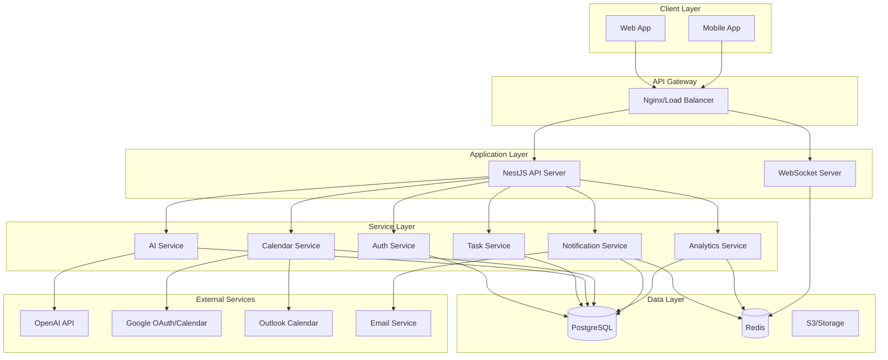

# Study Teddy Backend Architecture

## System Architecture Overview



## Module Structure

```
apps/backend/src/
├── modules/
│   ├── auth/                 # Authentication & authorization
│   │   ├── guards/           # JWT, API key guards
│   │   ├── strategies/       # Passport strategies
│   │   └── dto/             # Data transfer objects
│   │
│   ├── subjects/             # Subject management
│   │   ├── dto/
│   │   ├── subjects.controller.ts
│   │   └── subjects.service.ts
│   │
│   ├── tasks/                # Task & subtask management
│   │   ├── dto/
│   │   ├── tasks.controller.ts
│   │   ├── subtasks.controller.ts
│   │   └── services/
│   │
│   ├── focus-sessions/       # Focus session tracking
│   │   ├── dto/
│   │   ├── focus-sessions.controller.ts
│   │   └── focus-sessions.service.ts
│   │
│   ├── ai/                   # AI integration
│   │   ├── dto/
│   │   ├── ai.controller.ts
│   │   └── services/
│   │       ├── openai.service.ts
│   │       ├── taskify.service.ts
│   │       └── tutor.service.ts
│   │
│   ├── calendar/             # Calendar integration
│   │   ├── dto/
│   │   ├── calendar.controller.ts
│   │   └── providers/
│   │       ├── google-calendar.service.ts
│   │       └── outlook-calendar.service.ts
│   │
│   ├── notifications/        # Notification system
│   │   ├── dto/
│   │   ├── notifications.controller.ts
│   │   ├── notifications.gateway.ts
│   │   └── channels/
│   │       ├── email.channel.ts
│   │       ├── push.channel.ts
│   │       └── in-app.channel.ts
│   │
│   └── analytics/            # Analytics & insights
│       ├── dto/
│       ├── analytics.controller.ts
│       └── aggregators/
│
├── common/
│   ├── decorators/          # Custom decorators
│   ├── guards/              # Global guards
│   ├── interceptors/        # Request/response interceptors
│   ├── filters/             # Exception filters
│   └── middleware/          # Custom middleware
│
├── config/                   # Configuration
│   ├── database.config.ts
│   ├── jwt.config.ts
│   └── redis.config.ts
│
└── db/
    ├── schema/              # Drizzle schema definitions
    └── migrations/          # Database migrations
```

## Database Schema Design

### Core Tables

```sql
-- Users table
users (
  id UUID PRIMARY KEY,
  email VARCHAR UNIQUE,
  name VARCHAR,
  avatar_url VARCHAR,
  created_at TIMESTAMP,
  updated_at TIMESTAMP
)

-- Subjects table
subjects (
  id UUID PRIMARY KEY,
  user_id UUID REFERENCES users(id),
  name VARCHAR,
  color VARCHAR,
  icon VARCHAR,
  description TEXT,
  archived BOOLEAN DEFAULT false,
  created_at TIMESTAMP
)

-- Tasks table
tasks (
  id UUID PRIMARY KEY,
  user_id UUID REFERENCES users(id),
  subject_id UUID REFERENCES subjects(id),
  title VARCHAR,
  description TEXT,
  due_date TIMESTAMP,
  priority ENUM('low', 'medium', 'high'),
  status ENUM('pending', 'in_progress', 'completed'),
  estimated_minutes INTEGER,
  actual_minutes INTEGER,
  created_at TIMESTAMP,
  completed_at TIMESTAMP
)

-- Subtasks table
subtasks (
  id UUID PRIMARY KEY,
  task_id UUID REFERENCES tasks(id) ON DELETE CASCADE,
  title VARCHAR,
  completed BOOLEAN DEFAULT false,
  order INTEGER,
  created_at TIMESTAMP
)

-- Focus sessions table
focus_sessions (
  id UUID PRIMARY KEY,
  user_id UUID REFERENCES users(id),
  task_id UUID REFERENCES tasks(id),
  type ENUM('pomodoro', 'deep_work', 'custom'),
  status ENUM('scheduled', 'active', 'completed', 'cancelled'),
  start_time TIMESTAMP,
  end_time TIMESTAMP,
  scheduled_duration INTEGER,
  actual_duration INTEGER,
  productivity_rating INTEGER,
  focus_rating INTEGER,
  notes TEXT,
  created_at TIMESTAMP
)

-- AI interactions table
ai_chats (
  id UUID PRIMARY KEY,
  user_id UUID REFERENCES users(id),
  message TEXT,
  response TEXT,
  context VARCHAR,
  tokens_used INTEGER,
  created_at TIMESTAMP
)

-- Notifications table
notifications (
  id UUID PRIMARY KEY,
  user_id UUID REFERENCES users(id),
  type VARCHAR,
  title VARCHAR,
  body TEXT,
  read BOOLEAN DEFAULT false,
  data JSONB,
  created_at TIMESTAMP
)
```

## Service Communication Patterns

### Synchronous Communication
- REST APIs for client-server communication
- Direct service method calls within the application

### Asynchronous Communication
- Event-driven architecture using EventEmitter2
- Background job processing with BullMQ
- Real-time updates via WebSockets

### Event Flow Example

```typescript
// Task completion flow
1. Client → POST /api/tasks/:id/complete
2. TasksController → TasksService.complete()
3. TasksService → Database update
4. TasksService → EventEmitter.emit('task.completed')
5. Listeners:
   - NotificationService → Send completion notification
   - AnalyticsService → Update statistics
   - GamificationService → Award points
   - WebSocketGateway → Broadcast to client
```

## Caching Strategy

### Redis Cache Layers

1. **Session Cache**
   - JWT refresh tokens
   - User sessions
   - TTL: 7 days

2. **Data Cache**
   - User profiles
   - Subject lists
   - Task lists
   - TTL: 5 minutes

3. **Analytics Cache**
   - Computed metrics
   - Aggregated stats
   - TTL: 1 hour

4. **Rate Limiting**
   - API request counts
   - TTL: Based on window

## Security Implementation

### Authentication & Authorization
- JWT-based authentication
- Google OAuth 2.0 integration
- Role-based access control (future)

### API Security
- Rate limiting per endpoint
- Request validation with class-validator
- SQL injection prevention via Drizzle ORM
- XSS protection headers
- CORS configuration

### Data Security
- Password hashing with bcrypt
- Environment-based secrets management
- Encrypted sensitive data in database

## Performance Optimizations

### Database
- Indexed foreign keys and frequently queried columns
- Optimized query patterns with Drizzle ORM
- Connection pooling

### API
- Response caching for read-heavy endpoints
- Pagination for list endpoints
- Lazy loading for related data
- Request/response compression

### Background Jobs
- Async processing for heavy operations
- Scheduled tasks for notifications
- Batch processing for analytics

## Scalability Considerations

### Horizontal Scaling
- Stateless API servers
- Session storage in Redis
- Load balancing with Nginx

### Database Scaling
- Read replicas for analytics
- Partitioning for time-series data
- Archive old data to cold storage

### Microservices Ready
- Modular architecture allows service extraction
- Clear service boundaries
- Event-driven communication

## Monitoring & Observability

### Metrics
- API response times
- Database query performance
- Queue processing times
- Error rates

### Logging
- Structured logging with context
- Error tracking with Sentry
- Audit logs for sensitive operations

### Health Checks
- Database connectivity
- Redis connectivity
- External service availability
- Queue health

## Deployment Architecture

### Development
```
Docker Compose
├── NestJS API (hot reload)
├── PostgreSQL
├── Redis
└── Nginx
```

### Production
```
Kubernetes/ECS
├── API Pods (3+ replicas)
├── PostgreSQL (RDS)
├── Redis (ElastiCache)
├── S3 (file storage)
└── CloudFront CDN
```

## Technology Decisions

### Why NestJS?
- Enterprise-grade TypeScript framework
- Modular architecture
- Built-in dependency injection
- Excellent testing support
- Active community

### Why PostgreSQL?
- ACID compliance
- Complex query support
- JSON/JSONB for flexible data
- Full-text search capabilities
- Proven reliability

### Why Redis?
- High-performance caching
- Pub/sub for real-time features
- Session management
- Rate limiting
- Queue backend

### Why Drizzle ORM?
- Type-safe queries
- Lightweight and fast
- Migration support
- SQL-like syntax
- Good TypeScript integration